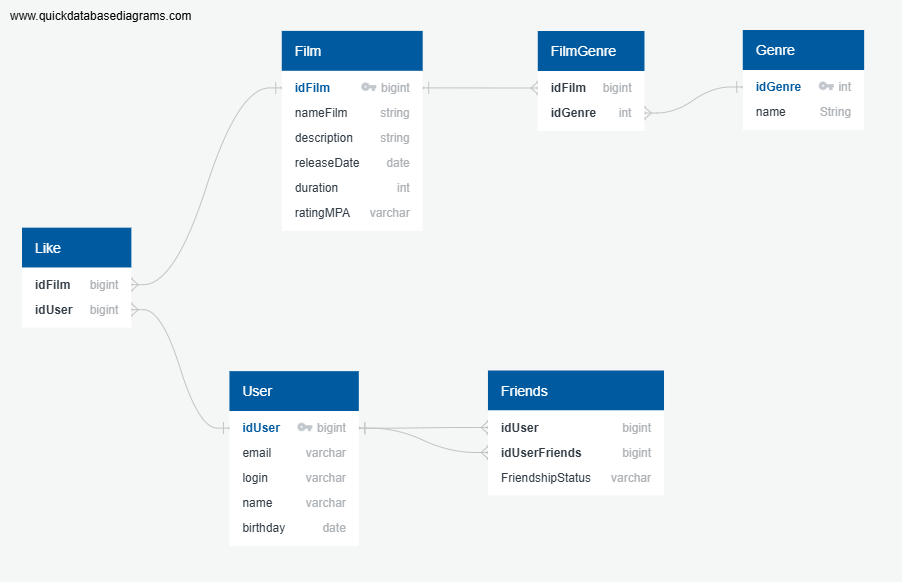

# java-filmorate
Template repository for Filmorate project.

# Database Schema

# Пример SQL-запроса на вывод 10 самых популярных фильмов отсортированных по количеству лайков в порядке убывания:
SELECT f.idFilm,
       f.nameFilm,
       f.description,
       f.releaseDate,
       f.duration,
       g.name,
       (SELECT COUNT(*) FROM Like l WHERE l.idFilm = f.idFilm) AS likesFilm
FROM Film AS f
LEFT OUTER JOIN FilmGenre AS fg ON f.idFilm = fg.idFilm
LEFT OUTER JOIN Genre AS g ON fg.idGenre = g.idGenre
ORDER BY likesFilm DESC
LIMIT 10;

# Пример SQL-запроса на вывод всех 10 пользователей отсортированных по id:
SELECT u.idUser,
       u.email,
       u.login,
       u.name,
       u.birthday,
       (SELECT COUNT(DISTINCT idUserFriends)
       FROM Friends
       WHERE idUser = u.idUser)
FROM User AS u
ORDER BY u.idUser DESC
LIMIT 10;

